# Bussiness Intelligence Dashboards
#### A compilation of all the BI related projects that I worked on
#### Datasets were found on kaggle or provided by the workshop
#### by Mai Tran

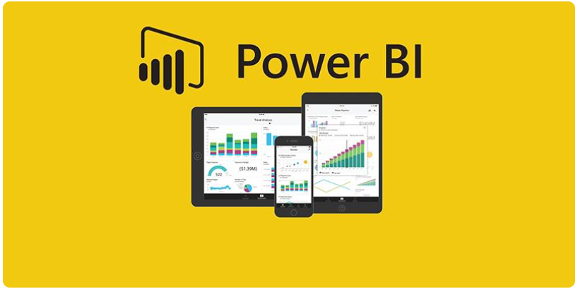

## Introduction
In this repository, I introduce all of the BI related project that I have done during my formation at Wild Code School. Normally, my coach provides me the source of datasets, I then use Pandas to process and clean date and visualize the insights on an interactive dashboard by using PowerBI.

## Megamax - Giant retailer of furniture, office supplies and technology products on line in the US

### Summary of the Project
With the increasing demand and fierce competition in the market, Megamax is looking for DA's insights to understand what works best for the company. Megamax would like to know which products, regions, categories and customer segments that should be targeted or avoided.

At the end of analysis, expected dashboard will have the following indicators:
* Monthly sales and profits,
* Sales by category and subcategory,
* Profit analysis by category and subcategory,
* Profit analysis by product,
* Sales and profit analysis by customer segment,
* Sales and profit analysis by region and cities etc…

### Screenshots of Dashboard
***1. Overview***
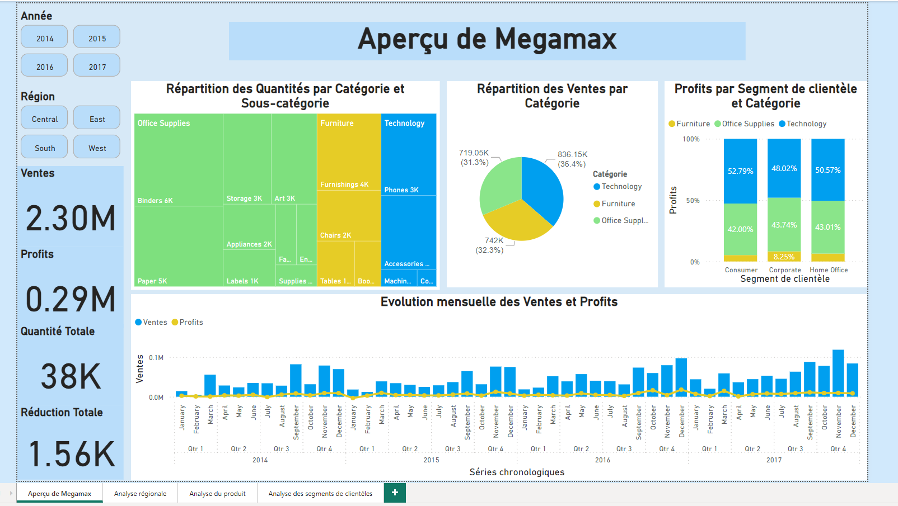

***2. Regional Analysis***
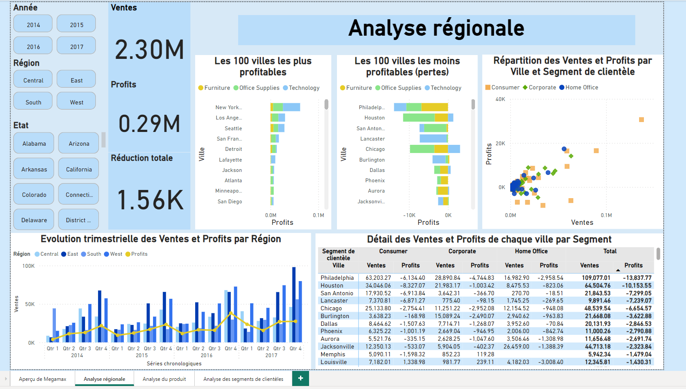

***3. Product Analysis***
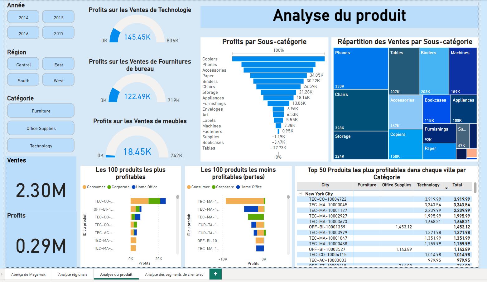

***4. Segment Analysis***
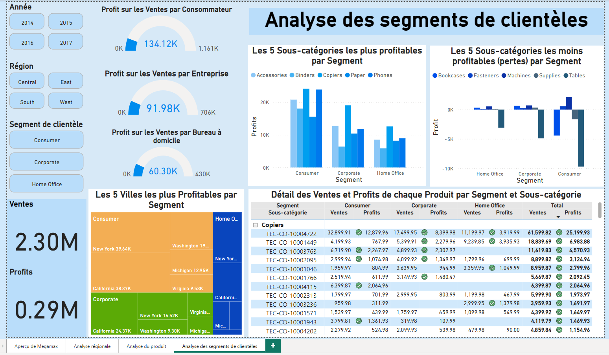

## Cyclistic - a bike sharing company in Chicago
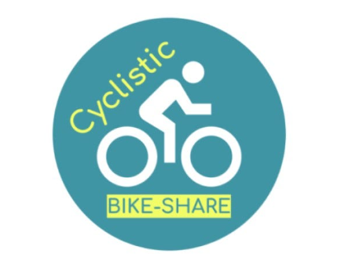

### Summary of the Project

You are a junior data analyst working in the marketing analyst team at Cyclistic.

The marketing manager believes that the future success of the company depends on increasing the number of annual subscriptions.

Therefore, your team wants to understand how occasional cyclists and annual members use Cyclistic bikes differently.

Based on this information, your team will develop a new marketing strategy to convert occasional cyclists into annual members.

But before that, Cyclistic’s executives need to approve your recommendations, so having compelling data analyses and professional data visualizations is essential.

There are three key questions that need to be answered at the end of the case study:

* How do annual members and occasional cyclists use Cyclistic bikes differently?
* Why would occasional cyclists buy Cyclistic annual subscriptions?
* How can Cyclistic use digital media to influence casual cyclists to become members?
* Where would you recommend Cyclistic to implement new stations to make the service more available?
  
### Screenshots of Dashboard
***1. Overview***
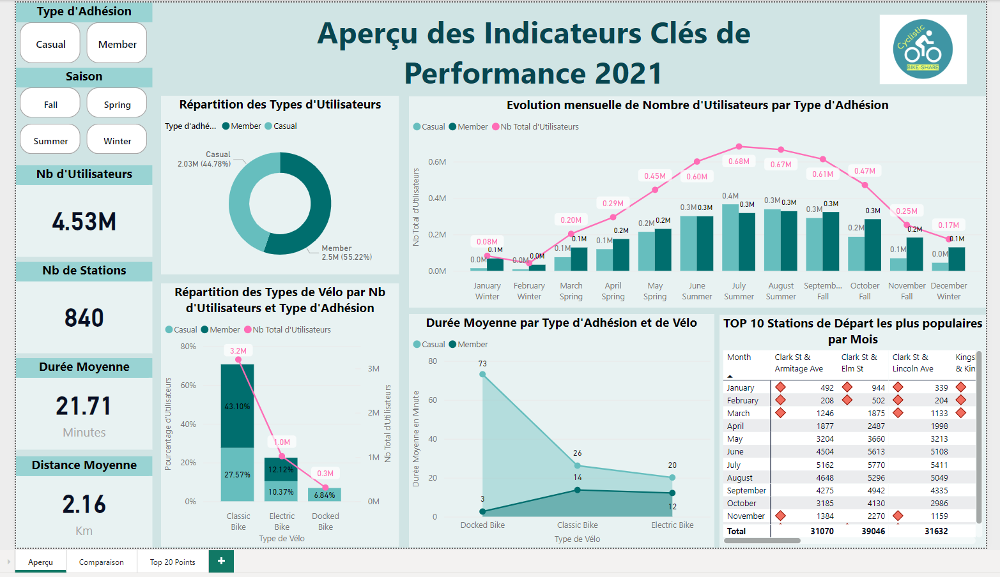

***2. Segment Behavior Comparison***
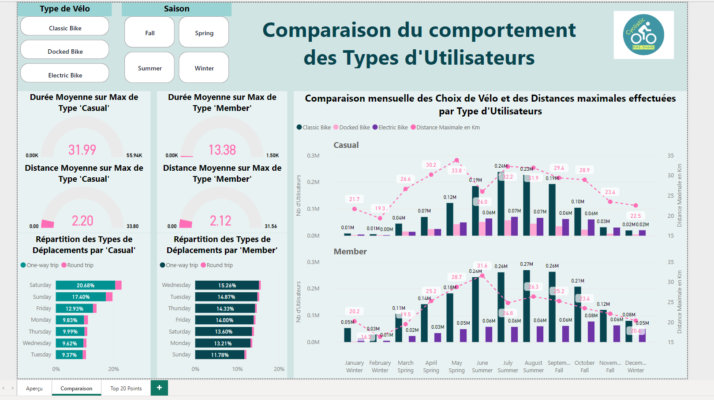

***3. Top 20 Popular Stations in Cartography***
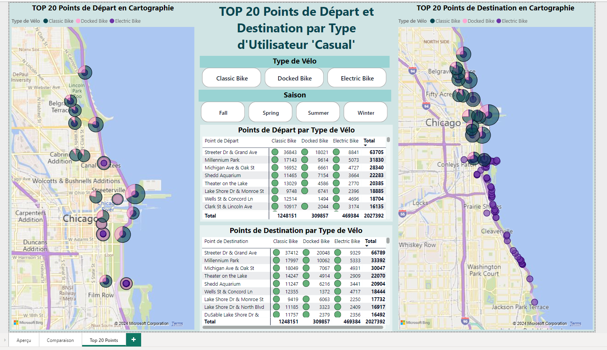

## Olist - E-commerce service for sellers in Brasil

### Context and Method
This is ***a business case in the framework of my DA certification exam*** hat I had only 8h to understand, approach, find problems and solutions according to the task requirement.

My approach: 
1. Check the quality of all databases
2. Combine the 2 databases related to 'Order' to calculate the delay of  every process in the order process (in days)
3. Define conditions to change number value (days) into label value to easier identify the factors of insatisfaction, also to easier communicate to the clients who don't understand very well the dataset.
4. Visualize on Power BI, point out problems and their actors, propose solutions. 

### Summary of the Project
***Mission***
* Objective: Help business leaders in their decision-making process.

* The CEO of Olist has tasked you with making sense of all the data in order to formulate recommendations on the following question:

* How to increase Olist customer satisfaction?

***About the dataset***
* Information on approximately 100,000 orders placed between 2016 and 2018. Real data! Identifiable information has been anonymized. Full documentation available in the dictionary provided.

* The process for each seller: The seller joins Olist and makes their product catalogs available to Olist. Olist displays these catalogs on existing commercial platforms (Amazon, Bahia, Walmart, ...). The seller receives a notification as soon as a product is sold. The seller transmits the ordered items to third-party logistics carriers.

* The process for the customer: The customer browses the products on the commercial platforms (Amazon, Bahia, Walmart, ...). He buys the products listed via Olist.store. He obtains an expected date for delivery, taking into account the estimated arrival time. The customer receives the order(s) and leaves a comment.

### Screenshots of Dashboard
***1. Client Evaluation Analysis***
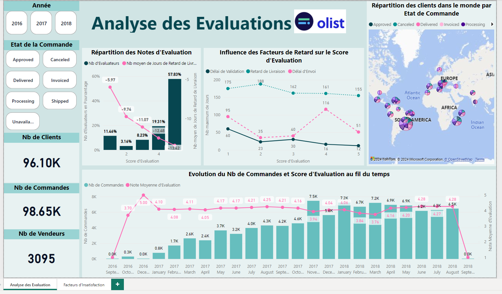

***2. Insatisfaction Factors Analysis***
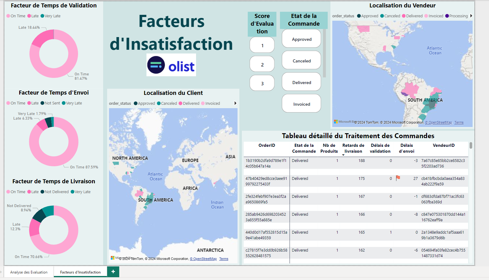

### Problems and Solutions

***Problems***
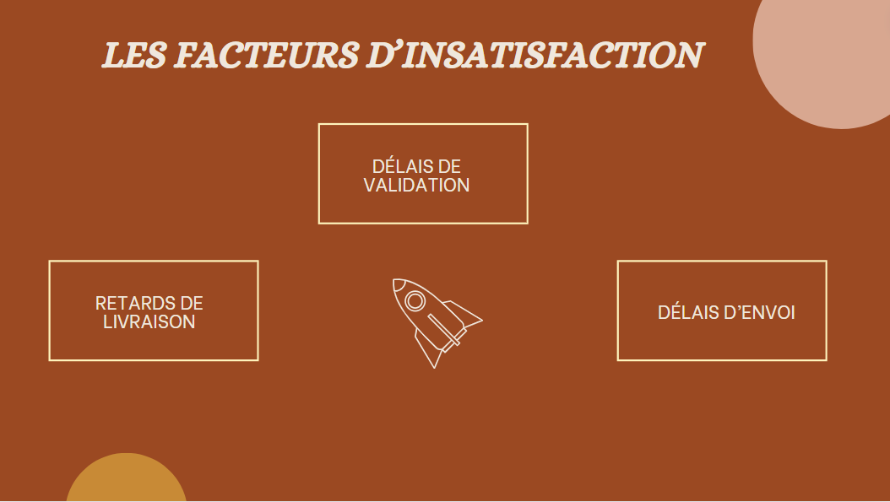

***Problems's Actors***
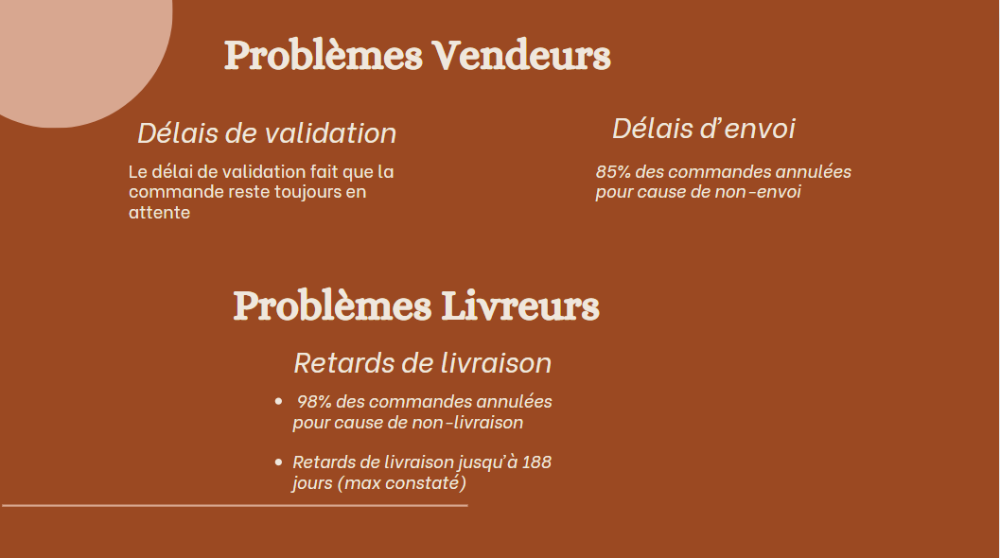

***Solution***
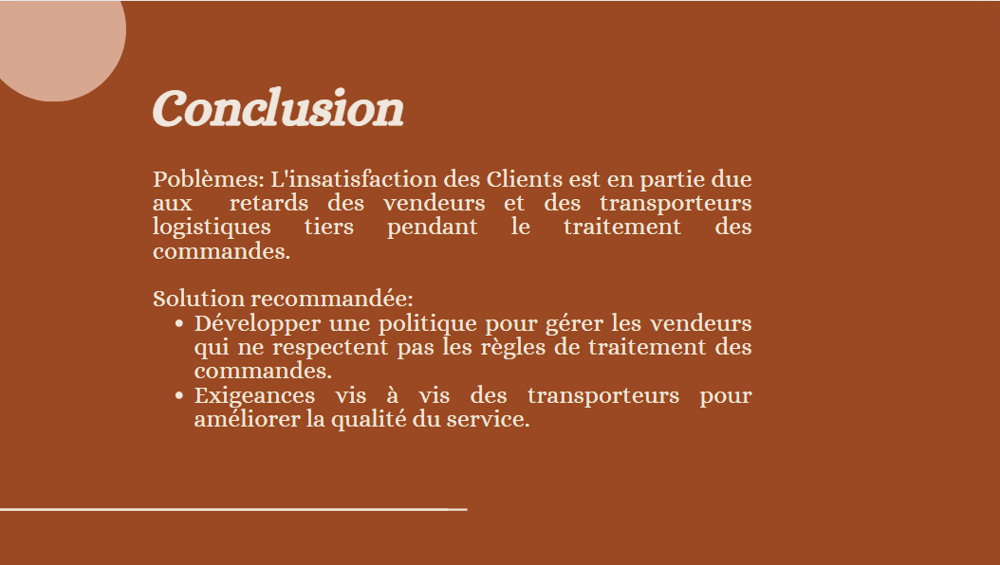

